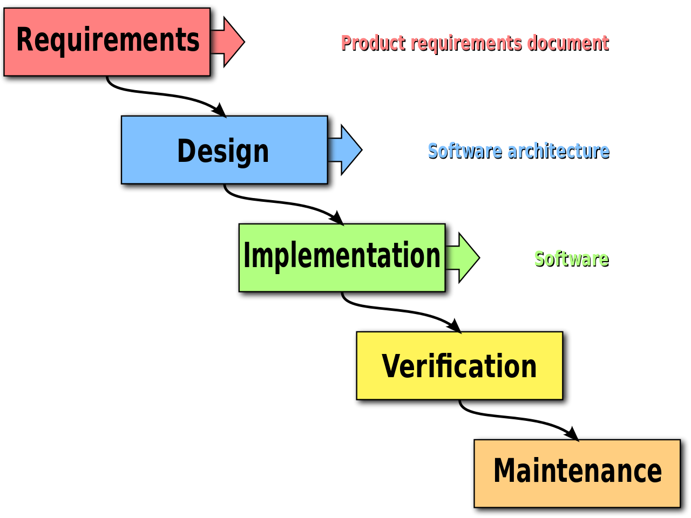
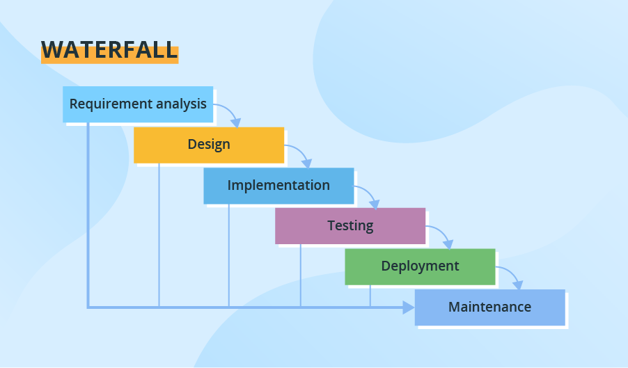
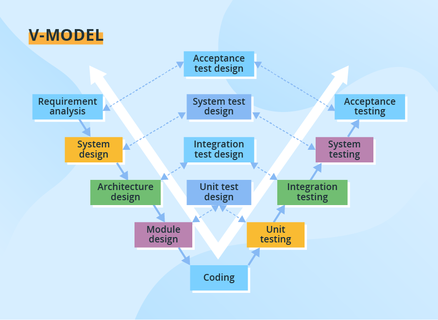
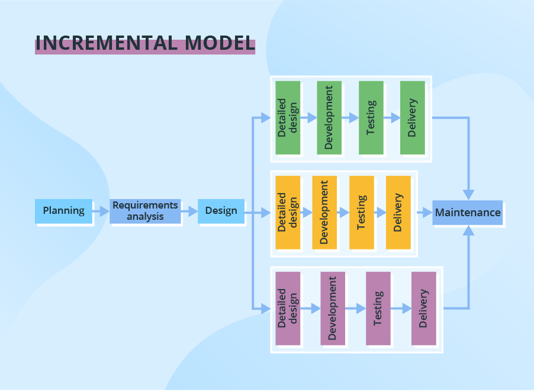
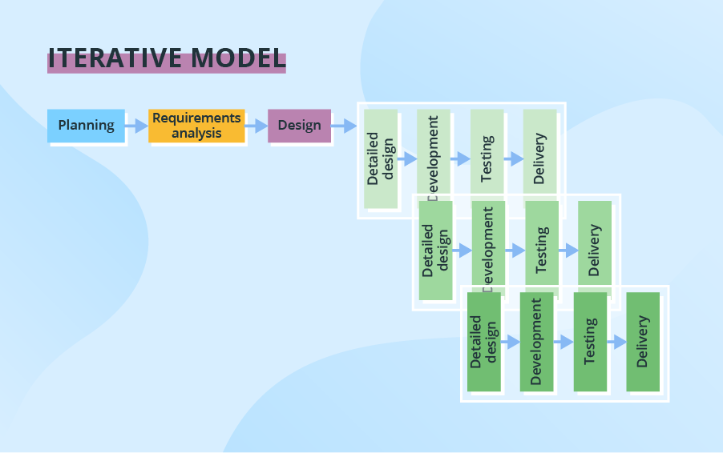
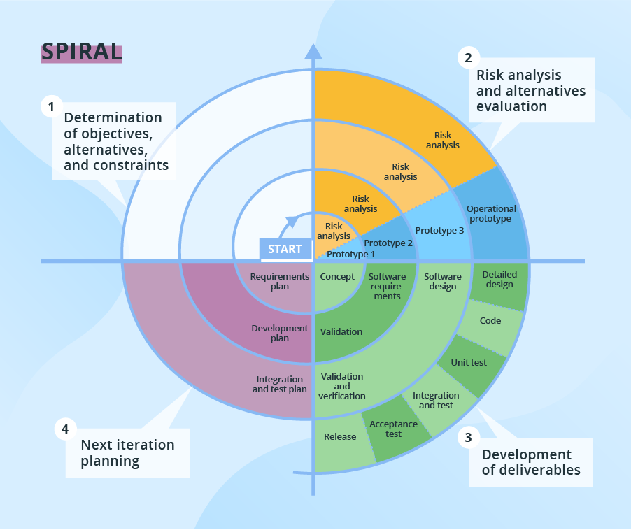
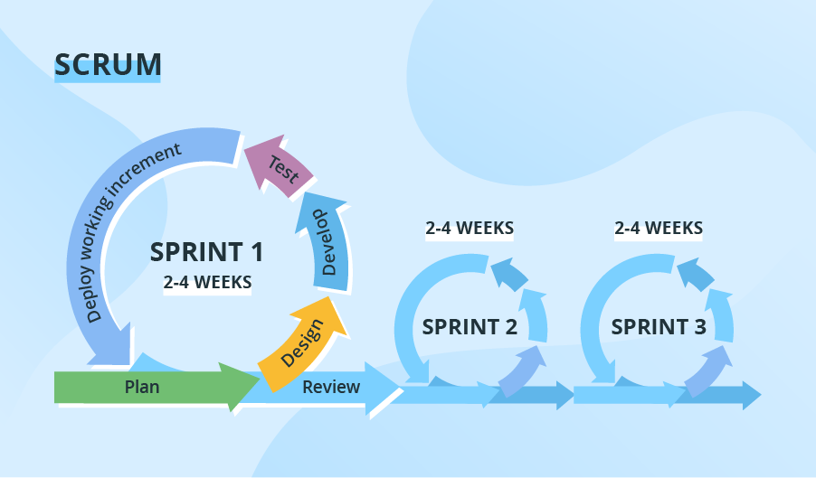
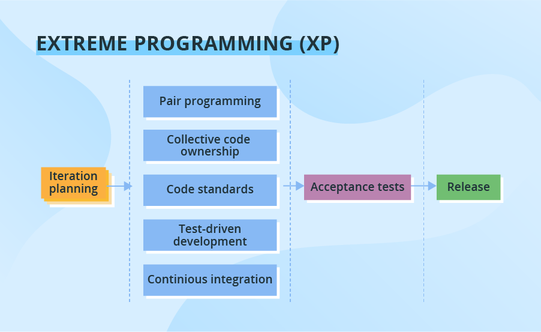

+++

title = "Introduction to Software Engineering"
description = "Quick introduction to SE nomenclature and concepts"
outputs = ["Reveal"]

+++

# Introduction to Software Engineering

{}

---

## Relevant nomenclature (pt. 1)

> __Computer Science__ (CS) is the study of _computation_, 
> i.e. the _automatic_ manipulation of _information_ via __algorithms__

(intuitive definition provided by the teacher)

 

> An __algorithm__ is a _finite_ set of _well-defined_
> rules for the solution of a __problem__ in a _finite_
> number of _steps_

(from [IEEE Standard Glossary](https://ieeexplore.ieee.org/document/159342))

---

## Relevant nomenclature (pt. 2)

> A __problem__ is a _well-defined_ specification of an information to be produced 
> (_output_) starting from some _initial_ information or preconditions (_input_)

(intuitive definition provided by the teacher)

 

- e.g. finding the _shortest path_ between two a source `S` and a destination `D` in a _graph_
- e.g. computing _ingredients quantities_ a `T`-jam flavored _cheesecake_ for `N` guests
- e.g. generating an aggregate report of _sales_ given a _database_ of _transactions_

---

## Relevant nomenclature (pt. 3)

- A __process__ is any operation aimed at transforming input into output when solving a problem
    + it may leverage some _storage_ (e.g. to store of _intermediate_ results)

- When both input and output are _data_, and the process is _automatic_, we are talking about _computation_
    + __data__ $\approx$ _representation_ of _information_

- Algorithms are a way to _express_ computation in a _formal_ way
    + __formal__ $\approx$ _unambiguous_, _precise_, _rigorous_ (i.e. such that a _machine_ can reproduce the process, precisely)
        - that machine is a _computer_

- Algorithms can be studied _independently_ of the _machine_ which executes them
    + e.g. to understand their _properties_, _limitations_, theoretical _costs_

---

## Information vs. representation

- __Information__ is a _concept_ which _exists_ in the _world_
    + e.g. the _meaning_ of a _word_, the _value_ of a _number_, the _color_ of a _pixel_

- __Representation__ is a _physical_ or _abstract_ _object_ which _carries_ information

- __Data__ is a _digital_ representation of information
    + e.g. a _sequence_ of _bits_, _bytes_, _characters_, etc.

---

## What is computer science essentially about

- Defining _algorithms_ as __recipes__ for processing _interesting problems_
    + requires clear __representations__ for input / output / storage __data__

- Studying algorithms’ __time/memory__ _requirements_, formally
    + as well as their __termination__

- Algorithms can be _combined_ to solve _more complex_ problems

---

## Example: sorting algorithm (Bubble sort)


{}

{}
{}
- `Input`: array of _comparable_ items
    + several algorithms to _compare_ items
        * depending on items _type_

 

- `Output`: sorted array
    + according to comparison strategy

 

- Many algorithms with different properties
    + e.g. _bubble sort_
{}


---

## Let's recall the big picture (pt. 1)

> Why do people care about algorithms in the first place?

- Put it simply, most people don't really care about algorithms per se

- They care about __automating__ the _solutions_ to _problems_
    + most commonly quicker, more precise, less error-prone than humans
        * (when the problem is _repetitive_ and _structured_ enough)
    
- Hence, _computers_ are __enablers__ for _automation_
    + and algorithms are the strategies followed by computers to solve problems

- However, _not_ all problems are as _simple_ as ordering an array
    + most real-world problems are _complex_, _multi-faceted_, and _ambiguous_

- _Effort_ and _creativity_ is required to understand how to 
    1. __decompose__ real-world _problems_ into simpler ones
    2. __select__ the right _algorithms_ to solve them
    3. __combine__ _algorithms_ to solve the original problem
    4. __instruct__ a _computer_ to do all such stuff

---

## More nomenclature (pt. 1)

(from [IEEE Standard Glossary](https://ieeexplore.ieee.org/document/159342))

> __Software__: computer _programs_, _procedures_, and possibly associated _documentation_ and data 
> pertaining to the operation of a computer system

- Software $\supset$ algorithms (software is _more general_ than algorithms)
    + all algorithms can be expressed in software
    + not all software is expressing algorithms
        * e.g. there are programs which are not meant to _terminate_ (OS, web servers, etc.)

---

## More nomenclature (pt. 2)

(from [IEEE Standard Glossary](https://ieeexplore.ieee.org/document/159342))

> __Software Engineering__ (SE) definition:
>
> (1) The application of a _systematic_, disciplined, quantifiable approach to the _development_, operation, 
> and maintenance of __software__; that is, the application of engineering to software. 
>
> (2) The study of approaches as in (1).

- Focus on the _development_ of a software _product_ ...
    + i.e. something which needs to _meet requirements_

- ... and on the _process_ of developing it
    + i.e. making the process _reproducible_, _sustainable_, and _maintainable_

---

## Let's recall the big picture (pt. 2)

- Demand is for _automation_ of _solutions_ to _problems_

- Supply is for _products_ which do that by means of
    + computers (__hardware__), as produced by _electronic engineering_ ...
    + running __software__, as produced by _software engineering_

- Computer engineering mostly focuses on creating __general-purpose__ computers
    + i.e. computers which can be instructed to solve _any_ problem
        * (given the right _software_)

- Software engineering mostly focuses on creating __specific-purpose__ software
    + i.e. software which solves a particular set of problems
        * (when run on a _general purpose_ computer)

---

## What is software engineering essentially about (pt. 1)

- Studying how to __realise__ software _products_ which meets _customers' requirements_
    + __customers__ $\approx$ the _stakeholders_ seeking for automatic solutions to problems
    + __requirements__ $\approx$ description about _what_ problems should be solved + constraints about _how_

- As the goal is a product...
    + ... _success_ is measured in terms of __requirements satisfaction__
        * i.e. whether the products is _effective_ / _efficient_ w.r.t. the requirements
    + ... a notion of product __lifecycle__ is inherently present
        * from requirements specification to implementation, _and beyond_
            <!--  -->
            - there including validation, and __maintenance__



---

## What is software engineering essentially about (pt. 2)

- As it is an engineering discipline, _optimization_ of the _development_ process is a key concern
    + mostly because _demand will evolve_ and _requirements will change_
        * and __nobody__ wants to _restart_ development from scratch
    + also because the product will need to be _maintained_ over time
        * and it is _boring_ and _costly_ to maintain the software
    + also because optimising development can, on __the long run__,
        1. _reduce_ the _cost_ of the product
        2. _increase_ the _quality_ of the product
        3. _reduce_ the _time_ to market of novel features / products

- Software development should be _reproducible_, _sustainable_, _evolvable_, _maintainable_, and _scalable_
    + __reproducible__ $\approx$ repeatable, with _predictable_ outcomes
    + __sustainable__ $\approx$ it's possible to _timely_ satisfy requirements with _controllable_ costs and efforts
    + __evolvable__ $\approx$ it's possible to _adapt_ the product to _new_ requirements in a sustainable way
    + __maintainable__ $\approx$ it's possible to _fix_, _improve_, or just keep the product _alive_ in a sustainable way
    + __scalable__ $\approx$ it's possible to _grow_ the product in terms of _size_, _complexity_, and _features_ in a sustainable way

---

## Why is software engineering relevant?

- _Software_ is _everywhere_
    + from _smartphones_ to _cars_, from _fridges_ to _toasters_, from _banks_ to _hospitals_, from _schools_ to _governments_, from _entertainment_ to _science_, from _industry_ to _agriculture_

- _Software_ is a strange sort of product
    + it's _intangible_, _invisible_, and _weightless_; most people don't really understand _how it works_, internally
    + __zero marginal cost__: the cost of producing one more product unit is negligible
    + most of the cost is in the _conception_, _development_ and _maintenance_ of the product

- Some software products may also come with:
    + __infrastructural__ costs (e.g. servers, networks, licenses, energy, cooling, etc.)
    + __operational__ costs (e.g. people operating the servers, networks, etc.)

- Most cost entries are (directly or indirectly) _personnel_ costs
    + personnel must be creative, knowledgeable, disciplined, motivated, and _coordinated_
        * performance is not really proportional to the amount of person-time spent  

- Misunderstanding these aspects can lead to __software crises__
    + cf. [A Collection of Well-Known Software Failures](https://www.cse.psu.edu/~gxt29/bug/softwarebug.html)
    + cf. [37 Epic Software Failures that Mandate the Need for Adequate Software Testing](https://www.cigniti.com/blog/37-software-failures-inadequate-software-testing/)

---

## About software crises

(from Wikipedia: ["Software crisis"](https://en.wikipedia.org/wiki/Software_crisis) and ["History of software engineering"](https://en.wikipedia.org/wiki/History_of_software_engineering))

- __Software crisis__ is a term used in the early days of CS (_1960s_, _1970s_, and _1980s_)

- It refers to the _difficulty_ of delivering useful and efficient software on time and within budget

- Software crises recurred several times, as the _computational power_ of computers increased (cf. [Moore's Law](https://en.wikipedia.org/wiki/Moore%27s_law))
    + due to the mismatch among the _complexity_ of the software...
    + ... and the _inadequacy_ of the _methods_ used to develop it

- Common issues:
    + projects running _over-budget_ or _over-time_
    + software was very _inefficient_ or _low-quality_
    + software often did _not meet requirements_
    + projects were _unmanageable_ and code _difficult to maintain_
    + software was _never delivered_

---

## In your opinion...

1. what makes software development _costs rise_?
0. what may _delay_ software development?
0. why could software _miss_ requirements?
0. why may software be _inefficient_?
0. what does it mean for software to be of _low-quality_?
0. what makes code (un)*manageable* or (un)*maintainable*?

 

Hopefully, you will have clear answers to these questions by the end of this course

---

## Why is software engineering relevant for Digital Transformation?

+ Should you become __managers__ or __entrepreneurs__ in the future, you will need to:
    - _plan_ and _supervise_ software projects
    - understand explicit and implicit _costs_ of software development
    - _communicate_ with _technical_ personnel
    - understand not only the result but also the _process_ of software development

+ Should you be in charge of __realising__ the __digital transformation__ in some organization, you will need to:
    - indentify _where_ automation can _add value_ to the organization
    - detect ill-defined development processes and how to _improve_ them
    - be up to date with _state-of-the-art_ software development practices
    - be able to _interpret requirements_ and translate them into a _software design_

+ Should you be __involved in__ the practical exploitation of __software engineering__, you will need to:
    - understand _what_ you're doing, and _why_
    - be knowleadgeable about _how_ to do it
    - be able to communicate with _management_, _technical_, _commercial_ personnel

---

## What are you expected to learn in this course

> The focus is _not_ on coding skills

Yet, you'll be exposed to _some_ coding exercises, 

in order for you to experience _first-hand_ the _challenges_ of software development

 

### Goals
- understand the _process_ of software development
- clearly understand what is the purpose of _each_ __phase__ of the process
- understand where _costs_ and _efforts_ come from
- being (in principle) able to _plan_ and _supervise_ a software project
- understand technical jargon and _communicate_ with technical personnel

--- 

# Overview on software engineering phases

(A few spoilers about the course, just to give you the full picture)

---

## Software engineering phases (pt. 1)

1. __Use case collection__: _negotiate_ expectations with customer(s) or stakeholders
    + output: a set of [user stories](https://en.wikipedia.org/wiki/User_story)

2. __Requirements analysis__: produce a list of _requirements_ the final product should satisfy
    + requirement $\approx$ description about _what_ problems should be solved + constraints about _how_
    + for each requirement, a _clear_ and _unambiguous_ __acceptance crierion__ should be defined
    + _priorities_ and _weights_ may be assigned to requirements

---

## Software engineering phases (pt. 2)

3. __Design__: produce a _blueprint_ of the software
    + __modelling__: what entities from the _real world_ are represented in the software?
        * how do they _behave_? how do they _interact_?
    + __architecture__: how is the software _organised_?
        * what are the _components_? how do they _communicate_ over the _network_?

4. __Implementation__: write the _code_ that reifies the _design_ into software

5. __Verification__: verify that the software _meets_ the _requirements_
    + __automated__ _testing_: write more code to check whether the aforementioned implementation code works
    + __acceptance__ _testing_: test the system with _real_ data and _real_ users

---

## Software engineering phases (pt. 3)

6. __Release__: make one particular _version_ of the software _available_ to the _customers_
    + most commonly, publish the software _package_ on a _server_ and make it _accessible_ via the _web_

7. __Deployment__: install and activate the software for the software
    + e.g. installer for desktop software, or mobile apps
    + e.g. continous deployment for web services

8. __Documentation__: produce _manuals_ and _guides_ for the software
    + _user manual_: how to _use_ the software
    + _developer manual_: how to _manipualte_ the software code base

9. __Maintenance__: fix _bugs_, _improve_ the software, _adapt_ it to _new_ requirements
    + potentially _reiterate_ the whole process

---

## Common misconception about SE phases

- As the phases are often presented in an _orderly_ fashion...
    + ... it is easy to think that they are _sequential_ and _non-overlapping_
        * __this is false__

- In practice:
    + the _process_ of software development is _iterative_
        * i.e. it is _repeated_ over and over again
    + phases may _overlap_ and _interleave_
        * e.g. _requirements_ may change during _implementation_
        * e.g. _verification_ may reveal _design_ flaws
        * e.g. _maintenance_ may require _re-design_

- Most notably, verification may start _before_ implementation
    + it's better to have verification procedure in place _before_ writing code
    + so thay they can _guide_ the implementation process

- Different _lifecycle models_ exist in the SE literature, governing the _order_ and _interleaving_ of phases
    + cf. [8 Software Development Models: Sliced, Diced and Organized in Charts](https://www.scnsoft.com/blog/software-development-models)

---

## SE Lifecycle Models Overview (pt. 1)

Phases are _sequential_ despite _partially overlapping_

---

## SE Lifecycle Models Overview (pt. 2)

Still _sequential_, but with _interleaved verification_ phases

---

## SE Lifecycle Models Overview (pt. 3)

Starting from an _abstract design_, 
a number of _iterations_ are perfomed, one per _module_

---

## SE Lifecycle Models Overview (pt. 4)

Design and subsequent phases are _repeated_ over and over again, for refinement

---

## SE Lifecycle Models Overview (pt. 5)

Focus on _risk analysis_, whihc is performed at each iteration

---

## SE Lifecycle Models Overview (pt. 6)

Most famous model for _agile_ development.

The goal is balance time to market with agile reactivity to requirements changes.

---

## SE Lifecycle Models Overview (pt. 7)

Focus on the delivery of _working software_ in _short_ time frames.

Attempts to mitigate the consequnet risk of _low-quality_ code.

---

## In the remainder of this course

- We will describe the many activities involved in each phase
    + encompassing phases _one by one_
    + following a _bottom-up_ approach

- In this module, will focus on most _technical_ aspects of SE...
    + i.e. the _implementation_, _validation_, _release_, _deployment_, _maintenance_ phases

- ... the next module will focus on most _conceptual_ aspects of SE
    + from use-case colletion to design

__Rationale__: grasping conceptual aspects is easier when you have a _clear_ idea of the underlying _technical_ aspects

---

{}