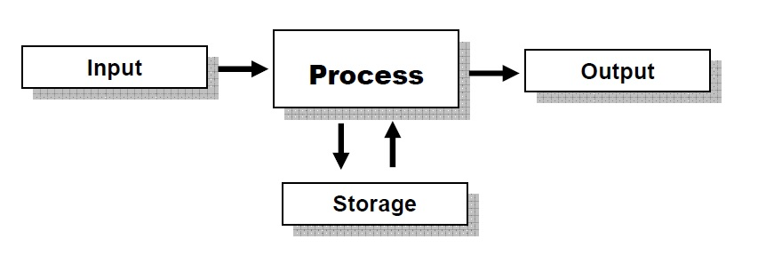

+++

title = "Introduction to Software Engineering"
description = "QA, reproducibility, TDD"
outputs = ["Reveal"]

+++

# Introduction to Software Engineering

{}

---

## Relevant nomenclature

> __Computer Science__ (CS) is the study of _computation_, 
> i.e. the _automatic_ manipulation of _information_ via _algorithms_

> An __algorithm__ is _finite sequence_ of _reproducible steps_ 
> to transform _input_ data into _output_ data

---

## What is computer science essentially about

- Defining algorithms as the recipe for processing interesting problems
    + requires clear representations for input / output / storage data

- Studying algorithms’ _time/memory requirements_, formally
    + as well as their _termination_

- Algorithms can be _combined_ to solve _more complex_ problems

---

## Example: sorting algorithm (Bubble sort)


{}

{}
{}
- Input: array of comparable items
    + several algorithms to compare items
        * depending on items type

 

- Output: sorted array
    + according to comparison strategy

 

- Many algorithms with different properties
    + e.g. bubble sort
{}


---

## More nomenclature

(from [IEEE Standard Glossary](https://ieeexplore.ieee.org/document/159342))

> __Software Engineering__ (SE) definition:
>
> (1) The application of a systematic, disciplined, quantifiable approach to the development, operation, and maintenance 
>    of software; that is, the application of engineering to software. 
>
> (2) The study of approaches as in (1).

> __Software definition__: computer programs, procedures, and possibly associated documentation and data 
> pertaining to the operation of a computer system
